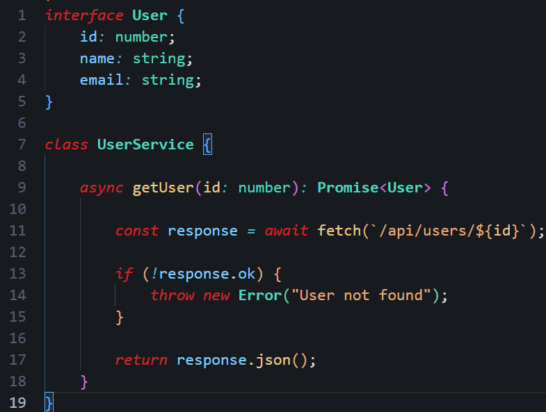
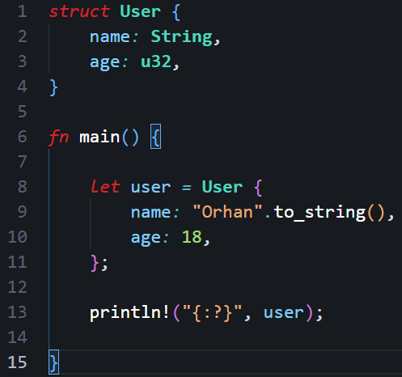

# Spino Dark

  <h1 align="center">⚫ Spino Dark</h1>
  

    A modern, elegant, and carefully crafted dark theme for Visual Studio Code.
     
    Designed for developers who value readability, consistency, and long coding sessions.
  

---

## ✨ Overview

Spino Dark is a carefully designed dark theme built with one goal in mind: **providing a clean, comfortable, and distraction-free coding experience**.

Every color has been selected to improve readability while maintaining a modern appearance. Whether you're writing TypeScript, Rust, Python, C++, HTML, CSS, or any other language, Spino Dark aims to make your code look beautiful without sacrificing clarity.

Instead of using overly saturated colors or extreme contrast, Spino Dark balances aesthetics and usability to reduce visual fatigue during long programming sessions.

---

## 🚀 Features

* 🎨 Modern and elegant dark color palette
* 👀 Excellent readability
* 🌙 Comfortable for long coding sessions
* ⚡ Carefully selected syntax highlighting
* 💻 Optimized for Visual Studio Code
* 🧠 Clean and consistent UI colors
* 🔥 High-quality editor experience
* 📦 Lightweight with no unnecessary overhead
* 🧩 Supports a wide range of programming languages
* ❤️ Designed with developers in mind

Support for additional languages will continue to improve over future releases.

---

## 🎯 Design Philosophy

Spino Dark follows a simple philosophy:

> **Focus on your code, not your colors.**

The goal is to create a development environment that feels calm, consistent, and productive.

Instead of overwhelming your eyes with aggressive colors, Spino Dark emphasizes important syntax while keeping secondary elements subtle and balanced.

---

## 📷 Preview

### TypeScript

---

### Rust

---

## 📦 Installation

1. Open **Visual Studio Code**
2. Go to **Extensions**
3. Search for **Spino Dark**
4. Click **Install**
5. Open **Preferences → Color Theme**
6. Select **Spino Dark**

---

## ❤️ Why Spino Dark?

Spino Dark is not just another dark theme.

It is built with attention to consistency, readability, and long-term usability. Every update is focused on making the editor feel cleaner, faster, and more enjoyable for developers of all experience levels.

Whether you're working on open-source projects, enterprise applications, or learning to code, Spino Dark is designed to stay out of your way and let your code shine.

---

## 🛣 Roadmap

Future updates may include:

* AMOLED Edition
* Light Edition
* High Contrast Edition
* Better semantic token support
* More language-specific highlighting
* Improved Git decorations
* Enhanced terminal colors
* Better Markdown styling
* Additional UI refinements

---

## 🤝 Contributing

Contributions, ideas, bug reports, and feature requests are always welcome.

If you have suggestions for improving Spino Dark, feel free to open an issue or submit a pull request.

---

## ⭐ Support

If you enjoy using Spino Dark, consider giving the project a ⭐ on GitHub.

Your support helps improve the project and motivates future updates.

---

## 📄 License

This project is licensed under the MIT License.

---

Made with ❤️ by <b>Orhan Alizadeh</b>

Building tools for developers.

